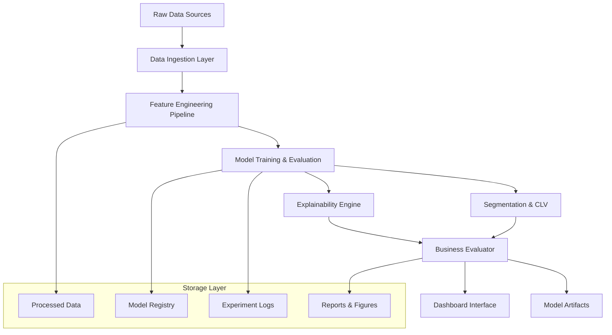

# Design Document

## Overview

The Enhanced Customer Churn Analysis system is designed as a modular, end-to-end ML pipeline that transforms raw customer data into actionable business insights. The system follows a layered architecture with clear separation between data processing, model training, evaluation, and presentation layers. The design emphasizes reproducibility, explainability, and business value through cost-sensitive evaluation and CLV integration.

## Architecture

### High-Level Architecture



### Component Architecture

The system is organized into distinct modules that can be developed and tested independently:

1. **Data Layer**: Handles ingestion, cleaning, and preprocessing
2. **Feature Layer**: Implements feature engineering and transformation pipelines
3. **Model Layer**: Manages training, evaluation, and model selection
4. **Explanation Layer**: Provides global and local model interpretability
5. **Business Layer**: Implements cost-sensitive evaluation and CLV calculations
6. **Presentation Layer**: Dashboard and reporting interfaces
7. **Deployment Layer**: Model serving and batch scoring capabilities

## Components and Interfaces

### 1. Data Ingestion Component (`src/data_prep.py`)

**Purpose**: Load, validate, and clean raw customer data

**Key Classes**:
- `DataLoader`: Handles CSV loading with type inference and validation
- `DataCleaner`: Implements cleaning rules and quality checks
- `DataSplitter`: Creates train/validation/test splits with temporal awareness

**Interfaces**:
```python
class DataLoader:
    def download_telco_data(self) -> str
    def download_olist_data(self) -> str
    def load_telco_data(self, filepath: str) -> pd.DataFrame
    def load_olist_data(self, data_dir: str) -> pd.DataFrame
    def validate_schema(self, df: pd.DataFrame) -> bool

class DataCleaner:
    def clean_telco_data(self, df: pd.DataFrame) -> pd.DataFrame
    def handle_missing_values(self, df: pd.DataFrame, strategy: dict) -> pd.DataFrame
    def detect_outliers(self, df: pd.DataFrame, method: str) -> pd.Series

class DataSplitter:
    def temporal_split(self, df: pd.DataFrame, date_col: str, test_size: float) -> tuple
    def stratified_split(self, df: pd.DataFrame, target_col: str, test_size: float) -> tuple
```

### 2. Feature Engineering Component (`src/features.py`)

**Purpose**: Transform raw features into ML-ready representations

**Key Classes**:
- `FeatureTransformer`: Implements numeric and categorical transformations
- `InteractionGenerator`: Creates feature interactions and aggregations
- `TimeFeatureGenerator`: Generates RFM and time-aware features
- `FeaturePipeline`: Orchestrates the complete feature engineering process

**Interfaces**:
```python
class FeatureTransformer:
    def create_numeric_pipeline(self, numeric_features: list) -> Pipeline
    def create_categorical_pipeline(self, categorical_features: list) -> Pipeline
    def create_interaction_features(self, df: pd.DataFrame, interactions: list) -> pd.DataFrame

class TimeFeatureGenerator:
    def generate_rfm_features(self, df: pd.DataFrame, customer_col: str, date_col: str, value_col: str) -> pd.DataFrame
    def calculate_recency(self, df: pd.DataFrame, reference_date: str) -> pd.Series
    def calculate_frequency(self, df: pd.DataFrame, customer_col: str) -> pd.Series
```

### 3. Model Training Component (`src/train.py`)

**Purpose**: Train, tune, and validate ML models

**Key Classes**:
- `ModelTrainer`: Handles model training and hyperparameter tuning
- `ModelEvaluator`: Implements cross-validation and performance assessment
- `ThresholdOptimizer`: Finds optimal probability thresholds for business objectives
- `ModelRegistry`: Manages model versioning and metadata

**Interfaces**:
```python
class ModelTrainer:
    def train_baseline_models(self, X: pd.DataFrame, y: pd.Series) -> dict
    def train_ensemble_models(self, X: pd.DataFrame, y: pd.Series, param_grids: dict) -> dict
    def calibrate_probabilities(self, model, X_val: pd.DataFrame, y_val: pd.Series) -> CalibratedClassifierCV

class ThresholdOptimizer:
    def optimize_business_threshold(self, y_true: np.array, y_prob: np.array, 
                                  value_retained: float, cost_contact: float) -> tuple
    def plot_cost_curves(self, y_true: np.array, y_prob: np.array, costs: dict) -> None
```

### 4. Explainability Component (`src/explain.py`)

**Purpose**: Generate model explanations and interpretability insights

**Key Classes**:
- `GlobalExplainer`: Creates global feature importance and interaction analysis
- `LocalExplainer`: Generates individual prediction explanations
- `ExplanationValidator`: Validates explanation consistency with domain knowledge

**Interfaces**:
```python
class GlobalExplainer:
    def generate_shap_summary(self, model, X: pd.DataFrame) -> dict
    def calculate_feature_interactions(self, model, X: pd.DataFrame) -> pd.DataFrame
    def create_partial_dependence_plots(self, model, X: pd.DataFrame, features: list) -> None

class LocalExplainer:
    def explain_prediction_shap(self, model, X_instance: pd.Series, X_background: pd.DataFrame) -> dict
    def explain_prediction_lime(self, model, X_instance: pd.Series, X_train: pd.DataFrame) -> dict
    def generate_action_recommendations(self, explanation: dict, business_rules: dict) -> list
```

### 5. Business Evaluation Component (`src/evaluate.py`)

**Purpose**: Assess model performance from business perspective

**Key Classes**:
- `BusinessMetrics`: Calculates lift, gains, and ROI metrics
- `SegmentAnalyzer`: Performs fairness and subgroup analysis
- `ReportGenerator`: Creates comprehensive evaluation reports

**Interfaces**:
```python
class BusinessMetrics:
    def calculate_lift_table(self, y_true: np.array, y_prob: np.array, n_deciles: int) -> pd.DataFrame
    def calculate_expected_savings(self, y_true: np.array, y_prob: np.array, 
                                 threshold: float, business_params: dict) -> dict
    def generate_gains_chart(self, y_true: np.array, y_prob: np.array) -> None

class SegmentAnalyzer:
    def analyze_subgroup_performance(self, y_true: np.array, y_prob: np.array, 
                                   segments: pd.Series) -> pd.DataFrame
    def check_calibration_fairness(self, y_true: np.array, y_prob: np.array, 
                                 segments: pd.Series) -> dict
```

### 6. Segmentation and CLV Component (`src/segment.py`)

**Purpose**: Customer segmentation and lifetime value calculation

**Key Classes**:
- `CustomerSegmenter`: Implements clustering algorithms for customer segmentation
- `CLVCalculator`: Computes customer lifetime value using statistical models
- `PriorityRanker`: Ranks customers for retention interventions

**Interfaces**:
```python
class CustomerSegmenter:
    def perform_kmeans_clustering(self, X: pd.DataFrame, n_clusters: int) -> tuple
    def profile_segments(self, df: pd.DataFrame, cluster_labels: np.array) -> pd.DataFrame
    def evaluate_clustering_quality(self, X: pd.DataFrame, labels: np.array) -> dict

class CLVCalculator:
    def fit_bgnbd_model(self, rfm_data: pd.DataFrame) -> BetaGeoFitter
    def fit_gamma_gamma_model(self, rfm_data: pd.DataFrame) -> GammaGammaFitter
    def predict_clv(self, customer_data: pd.DataFrame, time_horizon: int) -> pd.Series
```

### 7. Dashboard Component (`dashboards/app_streamlit.py`)

**Purpose**: Interactive web interface for model insights and customer analysis

**Key Features**:
- Overview dashboard with KPIs and model performance
- Customer risk ranking with actionable recommendations
- Individual customer detail pages with explanations
- Batch scoring interface for new data

## Data Models

### Core Data Structures

**Customer Record**:
```python
@dataclass
class CustomerRecord:
    customer_id: str
    demographics: Dict[str, Any]  # age, gender, location
    services: Dict[str, bool]     # service subscriptions
    billing: Dict[str, float]     # charges, tenure
    behavior: Dict[str, Any]      # usage patterns, support tickets
    churn_label: Optional[bool]   # target variable
```

**Prediction Result**:
```python
@dataclass
class PredictionResult:
    customer_id: str
    churn_probability: float
    risk_segment: str
    clv_estimate: float
    priority_score: float
    explanations: Dict[str, Any]
    recommended_actions: List[str]
```

**Model Metadata**:
```python
@dataclass
class ModelMetadata:
    model_id: str
    model_type: str
    training_date: datetime
    performance_metrics: Dict[str, float]
    feature_names: List[str]
    hyperparameters: Dict[str, Any]
    data_hash: str
```

### Database Schema (for production deployment)

```sql
-- Customer features table
CREATE TABLE customer_features (
    customer_id VARCHAR(50) PRIMARY KEY,
    feature_vector JSON,
    created_at TIMESTAMP,
    updated_at TIMESTAMP
);

-- Predictions table
CREATE TABLE predictions (
    prediction_id SERIAL PRIMARY KEY,
    customer_id VARCHAR(50),
    model_id VARCHAR(50),
    churn_probability FLOAT,
    prediction_date TIMESTAMP,
    FOREIGN KEY (customer_id) REFERENCES customer_features(customer_id)
);

-- Model registry table
CREATE TABLE model_registry (
    model_id VARCHAR(50) PRIMARY KEY,
    model_type VARCHAR(50),
    model_path VARCHAR(200),
    performance_metrics JSON,
    created_at TIMESTAMP,
    is_active BOOLEAN
);
```

## Error Handling

### Data Quality Issues
- **Missing Values**: Implement multiple imputation strategies (median, mode, forward-fill)
- **Outliers**: Use robust scaling and winsorization with configurable percentiles
- **Schema Drift**: Validate incoming data against expected schema and log discrepancies
- **Data Leakage**: Implement temporal validation and feature engineering safeguards

### Model Training Issues
- **Convergence Problems**: Implement early stopping and alternative optimizers
- **Memory Constraints**: Use batch processing and feature selection for large datasets
- **Class Imbalance**: Apply class weighting and sampling strategies
- **Overfitting**: Use regularization and cross-validation with proper evaluation protocols

### Production Issues
- **Model Drift**: Monitor prediction distributions and feature statistics
- **Performance Degradation**: Implement automated retraining triggers
- **Scaling Issues**: Design for horizontal scaling with containerization
- **API Failures**: Implement circuit breakers and fallback mechanisms

## Testing Strategy

### Unit Testing
- **Data Processing**: Test data cleaning, validation, and transformation functions
- **Feature Engineering**: Validate feature calculations and pipeline transformations
- **Model Training**: Test model fitting, prediction, and serialization
- **Business Logic**: Verify cost calculations, threshold optimization, and CLV computations

### Integration Testing
- **End-to-End Pipeline**: Test complete workflow from raw data to predictions
- **API Endpoints**: Validate dashboard and scoring service functionality
- **Data Persistence**: Test model saving/loading and result storage

### Performance Testing
- **Scalability**: Test with varying data sizes and concurrent users
- **Memory Usage**: Monitor memory consumption during training and inference
- **Response Times**: Ensure dashboard and API meet performance requirements

### Validation Testing
- **Cross-Validation**: Implement nested CV for unbiased performance estimates
- **Temporal Validation**: Use time-based splits for realistic performance assessment
- **Business Validation**: Compare model recommendations with historical outcomes

## Configuration Management

### Environment Configuration
```python
# config.py
@dataclass
class Config:
    # Data sources
    TELCO_DATASET_ID: str = "blastchar/telco-customer-churn"
    OLIST_DATASET_ID: str = "olistbr/brazilian-ecommerce"
    
    # Data paths
    RAW_DATA_PATH: str = "data/raw/"
    PROCESSED_DATA_PATH: str = "data/processed/"
    MODEL_PATH: str = "models/"
    
    # Model parameters
    RANDOM_SEED: int = 42
    TEST_SIZE: float = 0.2
    CV_FOLDS: int = 5
    
    # Business parameters
    RETENTION_VALUE: float = 1000.0
    CONTACT_COST: float = 50.0
    
    # Feature engineering
    NUMERIC_IMPUTATION: str = "median"
    CATEGORICAL_IMPUTATION: str = "most_frequent"
    OUTLIER_METHOD: str = "iqr"
    
    # Model training
    CALIBRATION_METHOD: str = "isotonic"
    HYPERPARAMETER_TRIALS: int = 100
```

### Experiment Tracking
- Use MLflow or similar for experiment logging
- Track hyperparameters, metrics, and artifacts
- Enable model comparison and rollback capabilities
- Maintain audit trail for regulatory compliance

This design provides a robust, scalable foundation for the customer churn analysis system while maintaining flexibility for future enhancements and business requirements.